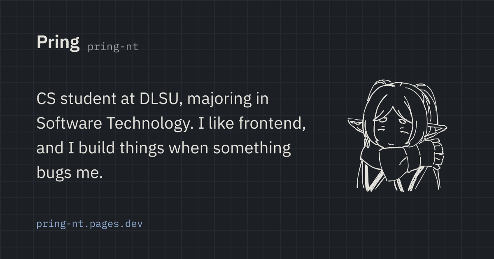

# pring-nt-portfolio

My personal site. It has two sides:

- **Pring**: an engineering notebook. Graph paper, plain words, projects written up as closed issues.
- **Natalie**: a pastel scrapbook. Gingham, taped cards, my drawings first, a lot more kaomoji.

Click the name in the header to flip between them. The choice (and light/dark mode) is remembered per browser.



## Stack

- [SvelteKit 3](https://svelte.dev/docs/kit) + Svelte 5 (runes) and TypeScript, prerendered with `adapter-static`
- [Tailwind CSS v4](https://tailwindcss.com), with the four themes as CSS variables in `src/app.css`
- [anime.js](https://animejs.com) for the persona switch entrances and the draggable polaroids, loaded after startup
- `@sveltejs/enhanced-img` for drawings and photos, [Fontsource](https://fontsource.org) for self-hosted fonts, [Lucide](https://lucide.dev) icons
- [bun](https://bun.sh) for everything

## Running it

```bash
bun install
bun run dev
```

| Command           | What it does                                        |
| ----------------- | --------------------------------------------------- |
| `bun run dev`     | Dev server                                          |
| `bun run build`   | Static build into `build/`                          |
| `bun run preview` | Serve the build                                     |
| `bun run check`   | `svelte-kit sync` + `svelte-check`                  |
| `bun run lint`    | Prettier check + ESLint                             |
| `bun run format`  | Prettier write                                      |
| `bun run og`      | Regenerate the link-preview image (`static/og.png`) |

## Where things live

```
src/
├─ routes/                 # home (both personas) and /experience
├─ lib/
│  ├─ content/             # all copy and data, typed (projects, likes, art, experience, ...)
│  ├─ components/          # pring/, natalie/, shared/
│  ├─ motion/              # anime.js intros and draggable polaroids
│  ├─ state/               # persona + color mode
│  └─ assets/              # pring/ doodles, natalie/art drawings, natalie/scrapbook finds
├─ app.html                # sets the theme before first paint
└─ app.css                 # themes, backgrounds, page transitions
scripts/og.ts              # renders static/og.png with satori
```

Both personas render from the same content files, so editing a project or a like in `src/lib/content/` updates both sides.

### Adding a drawing

1. Save it as WebP, about 1200px on the long side, in `src/lib/assets/natalie/art/`.
2. Add it to `src/lib/content/art.ts` with an `?enhanced` import, alt text and the Instagram post link (and a date if you want one under it).

### Adding found art

Scrapbook images go in `src/lib/assets/natalie/scrapbook/`. Credit each one: on the page through its `credit` (or `stickerCredits` in `src/lib/content/credits.ts`), and in [CREDITS.md](CREDITS.md).

### Link preview

`bun run og` draws Pring's dark-mode intro with the portrait doodle into `static/og.png`, using the real intro text and the site's fonts. Run it again after changing the intro, the doodle or the palette. The absolute URLs in the meta tags come from `siteUrl` in `src/lib/content/site.ts`, so update that when the site gets a custom domain.

## Deploying

Cloudflare Pages, connected to this repo:

- Build command: `bun run build`
- Output directory: `build`
- Environment variable: `BUN_VERSION=1.3.12`

## Credits

Found art (the favicon, Marin pictures and Natalie's stickers) is listed with its sources in [CREDITS.md](CREDITS.md). The doodles and drawings are mine.
